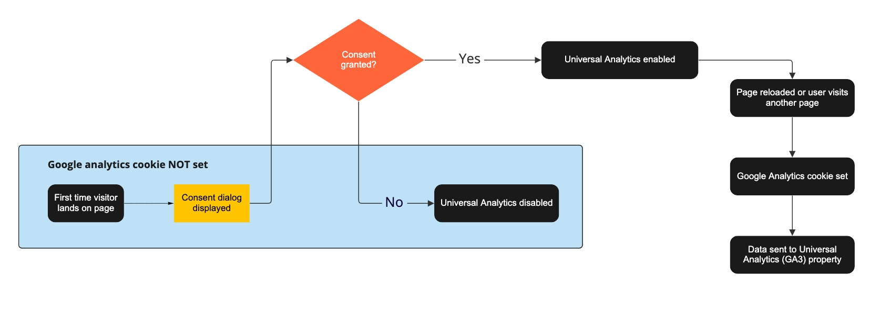
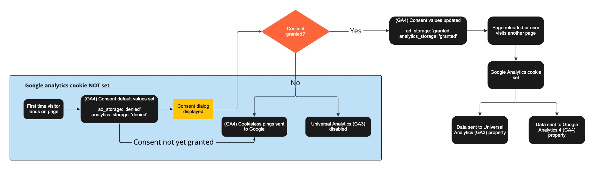

# Google Analytics GA4

**TL;DR : Estamos nos preparando para atualizar o Google Analytics para a versão 4.**

Há alguns meses , o cookie do Google Analytics (GA) foi recategorizado como “Cookie de desempenho”. Os usuários que têm acesso à  análise do site viram uma queda nas visualizações de página relatadas para suas respectivas comunidades. No início deste ano, o Google anunciou que o Universal Analytics (UA) será desativado e deixará de processar novos dados após 1º de julho de 2023. Nossa solução de longo prazo foi migrar para a versão mais recente do Analytics, Google Analytics 4 (GA4), que inclui mais controles de privacidade com o Modo de consentimento e um recurso de anonimização de IP padrão pronto para uso, o que significa que o GA4 não armazenará os endereços IP dos usuários.

Nesta artigo, forneceremos uma breve visão geral do recurso Modo de consentimento, quais alterações serão feitas e um plano de distribuição em etapas para quando a atualização ocorrerá nos sites de nossos clientes.

## O que é o Modo de Consentimento?

O Modo de consentimento é um recurso beta que ajusta o comportamento das tags do Google com base na opção de consentimento dos visitantes de concedido ou negado, no que se refere ao uso de cookies não essenciais que são desativados por padrão. Até que o consentimento seja concedido, o Google receberá pings sem cookies que informam o estado do consentimento e a atividade do usuário, em vez de armazenar cookies.

Esses pings incluem algumas informações funcionais e agregadas, não identificáveis, que permitem ao Google preencher a lacuna de dados usando aprendizado de máquina para modelar usuários que recusam cookies em comparação a usuários semelhantes que aceitam cookies. O que isso significa para nós é que poderemos entender melhor o comportamento do usuário e quaisquer outros dados de tráfego agregados, sem coletar nenhuma informação de identificação.

## Que mudanças serão feitas?

Estaremos executando nossa integração de UA existente em paralelo com o GA4. Ainda contamos com nossas análises existentes para relatar métricas agregadas de alto nível e a integração do GA4 em paralelo nos dá tempo para verificar a implementação e começar a construir os dados históricos. A razão para isso é porque não é possível migrar nossos dados existentes do UA para o GA4 devido às diferenças no esquema de dados e nas definições de dimensão.

Para a UA, o cookie de análise ainda será classificado como um “Cookie de desempenho”. Se o consentimento não for fornecido, os dados não serão enviados ao Google Analytics. Este é o comportamento atual e nenhuma alteração foi feita.

Com o GA4 e o Modo de consentimento ativados, o snippet de Javascript sempre será carregado nas páginas que você visitar, independentemente do status de consentimento. O que isso significa é que você verá pings sem cookies no Google Analytics para cada página que visitar; no entanto, os dados não serão armazenados ou lidos dos cookies do navegador (por exemplo, cookie _ga) até que o consentimento seja concedido. Seu status de consentimento continuará a persistir em todas as páginas que você visitar. Para obter mais informações sobre os comportamentos do Modo de consentimento, consulte o artigo da Central de Ajuda do Google .

Para obter uma visão geral de alto nível de nossa configuração de análise existente e como será nossa configuração com o GA4, consulte os diagramas abaixo.

**Aqui está um fluxograma simplificado de nossa configuração de UA existente:**

.

**E aqui está como será nossa configuração quando executarmos o UA e o GA4 em paralelo:**

.

## Linha do tempo

Aqui está o plano de lançamento, para que você saiba quando essas alterações serão feitas:

| ONDE  | QUANDO | STATUS |
| ------------- | ------------- | ------------- |
| Superusuário | Semana de 24 de setembro (ou antes) | Ao vivo a partir de 24 de setembro |
| Em toda a rede | Semana de 25 de setembro |  |

Embora não haja alterações na Política de Privacidade, você também pode esperar algumas atualizações em nossa página de Política de Cookies em nosso portal jurídico em um futuro próximo.

Se você encontrar algum bug relacionado ao GA, adicione uma resposta (uma resposta por bug) para que possamos triá-los e priorizá-los adequadamente. Também teremos prazer em responder a quaisquer perguntas que você possa ter sobre a atualização do GA4.
